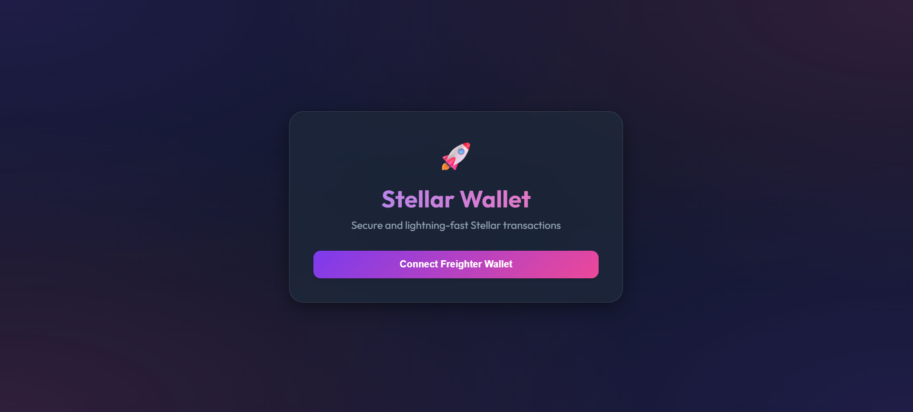
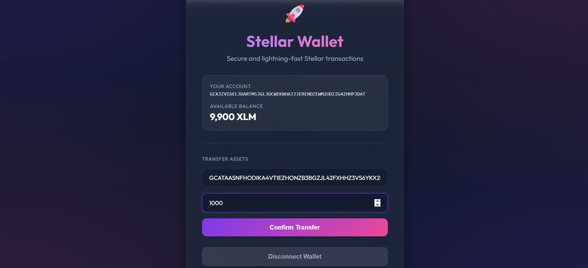
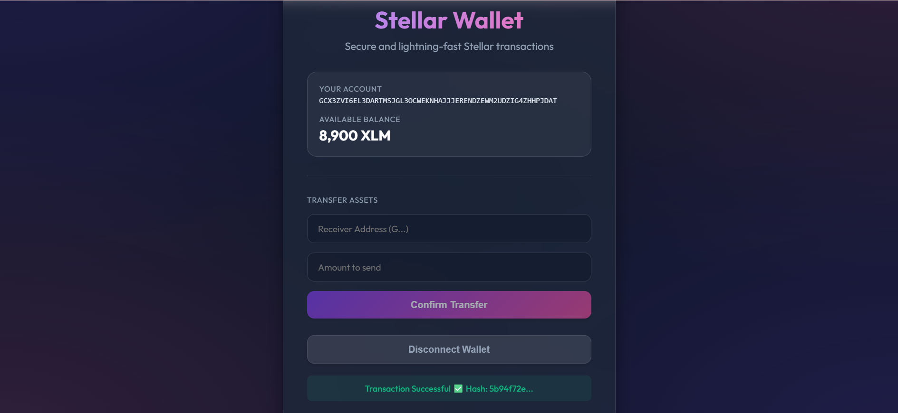

# 🚀 Stellar Pay | Premium Wallet Application

A state-of-the-art, high-performance decentralized application (dApp) built for the **Stellar White Belt - Level 1 Submission**. Stellar Pay features a premium Glassmorphism design and provides a seamless interface for interacting with the Stellar Testnet.

---

## 📖 Project Overview
Stellar Pay is designed to simplify blockchain interactions for everyday users. This application demonstrates the core pillars of Stellar development:
- **Universal Connectivity**: One-click integration with the Freighter Wallet.
- **On-Chain Transparency**: Real-time balance synchronization using the Horizon API.
- **Secure Transaction Engine**: High-speed XLM transfers with cryptographic security.
- **Premium UX**: A modern, dark-themed interface built for clarity and elegance.

---

## ✨ Features
- [x] **Secure Wallet Connect**: Seamlessly authorize and decouple your wallet.
- [x] **Live Asset Tracking**: Instant XLM balance updates from the Testnet.
- [x] **Smart Payment Flow**: Intuitive input fields for addresses and amounts.
- [x] **Transaction Verification**: Immediate feedback with transaction hash for every successful transfer.
- [x] **Responsive Aesthetics**: Optimized for all screen sizes with smooth micro-animations.

---

## 🛠️ Technology Stack
- **Frontend Framework**: React 19 (Vite)
- **Blockchain Connectivity**: [Stellar SDK (@stellar/stellar-sdk)](https://github.com/stellar/js-stellar-sdk)
- **Wallet Orchestration**: [Freighter API (@stellar/freighter-api)](https://www.freighter.app/)
- **Design System**: Vanilla CSS3 (Custom Glassmorphism Framework)
- **Network**: Stellar Testnet (`https://horizon-testnet.stellar.org`)

---

## ⚙️ How to Run Locally

### 1. Clone & Install
```bash
git clone <your-repository-url>
cd stellar-white-belt-main
npm install
```

### 2. Launch
```bash
npm run dev
```

---

## 📸 Application Showcase (New UI)

### 🔹 1. Wallet Dashboard
The main interface showing successful connection and account details.


### 🔹 2. Asset Verification
Displays the current available balance on the Stellar Testnet.


### 🔹 3. Transaction Proof
Feedback provided to the user after a successful on-chain transaction.


---

## 👩‍💻 Submission Checklist
- [x] Public GitHub Repository
- [x] Production-ready README.md
- [x] Fully functional Connect/Disconnect logic
- [x] Real-time Balance Fetching
- [x] On-chain XLM Transfer Logic
- [x] Transaction Hash Display

**Author**: Mayuri Jagdale  
**Level**: White Belt (Level 1 Candidate)
